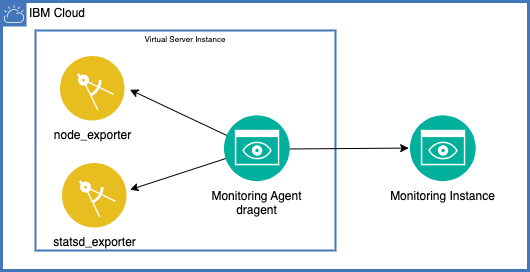

# VPC Instance custom metrics monitoring example

This example uses the IBM Cloud Monitoring service to display custom metrics created by an application running on a VPC Virtual Server Instance.


## Create resources

Create the following resources in the IBM cloud:
- [Monitoring](https://cloud.ibm.com/observe/monitoring) instance.  In the monitoring instance click the **Action** > **Obtain key**
- [Virtual Server Instance](https://cloud.ibm.com/vpc-ext/compute/vs) and a Floating IP.  This example is based on the ibm-ubuntu-20-04-3-minimal-amd64-2 image.  You can create the VPC resources required using the cloud console or use the terraform configuration in the [terraform/](./terraform/README.md) directory.

## Install the monitoring agent on the instance
The IBM Cloud Monitoring instance created earlier includes some easy to follow instructions to install a Linux agent:

- Open the [Monitoring](https://cloud.ibm.com/observe/monitoring) instance
  - Click your monitoring instance
  - Click **Monitoring sources** on the left
  - Click the **Linux** tab

  You can also check out [Deploying a monitoring agent](https://test.cloud.ibm.com/docs/monitoring?topic=monitoring-config_agent)
- ssh to the instance through the Floating IP and copy/paste the agent installation instructions for private (public will work as well).

Verify the installation of the agent: dragent:
- Check the content of /opt/draios/etc/dragent.yaml to find the Monitoring collector, customerid (ingestion key), etc.

```
cd /opt/draios/etc
cat dragent.yaml
```

Expected output something like:
```
customerid: 12345678-1234-1234-1234-123456789012
collector: ingest.us-south.monitoring.cloud.ibm.com
collector_port: 6443
ssl: true
sysdig_capture_enabled: false
```

- Check the logs to see if you notice anything alarming like Warnings or Errors
```
cd /opt/draios/logs
less draios.log
```

## Add Prometheus or StatsD to your application
The dragent is a [StatsD](https://github.com/statsd/statsd) server and can be configured as a [Prometheus](https://prometheus.io/) scraper/forwarder. Modern programming languages have open source libraries for both statsd client and prometheus client exporter. For python:
- [python prometheus client](https://pypi.org/project/prometheus-client/)
- [python statsd client](https://pypi.org/project/statsd/)

Install and verify python and pip.
```
apt update -y
apt install python -y
apt install python3-pip -y
```

Check the versions.  Something like:
```
root@custom2:/opt/draios/logs# python3 --version
Python 3.8.10
root@custom2:/opt/draios/logs# pip3 --version
pip 20.0.2 from /usr/lib/python3/dist-packages/pip (python 3.8)
```

Install the prometheus and statsd client support:
```
pip3 install prometheus-client statsd
```

There are three application programs: [example.py](./app/example.py), [async.py](./app/async.py) and [raw](./app/raw.py).  Each demonstrate a different way of capturing metrics using both statsd and prometheus.

cd; # go to home directory /root on ubuntu.  Create a async.py file from [async.py](./app/async.py)
```
cat > async.py <<EOF
<paste contents of async.py>
EOF
chmod 775 ./async.py
```

Then run the example python program, it should look like this:

```
root@custom2:~# ./async.py
Start up the prometheus collection server.  Have you created the /opt/draios/etc/prometheus.yaml, see README.md, for port 8000?
```

You will create the prometheus.yaml suggedted in a later step.

## Verify the python application 
The python application is running.  Open another ssh session to the instance or use `ctrl-z, bg` if you are familiar with the shell process management commands.

You can see the metrics being generated on port 8000 as promised by the message printed by the application:
```
curl localhost:8000/metrics
```

It should look about like this:
```
root@custom2:~# curl localhost:8000/metrics
# HELP python_gc_objects_collected_total Objects collected during gc
# TYPE python_gc_objects_collected_total counter
python_gc_objects_collected_total{generation="0"} 66.0
python_gc_objects_collected_total{generation="1"} 290.0
...
# TYPE custom_histogram histogram
custom_histogram_bucket{le="1.0"} 170.0
custom_histogram_bucket{le="2.0"} 472.0
custom_histogram_bucket{le="3.0"} 781.0
custom_histogram_bucket{le="4.0"} 1041.0
custom_histogram_bucket{le="5.0"} 1204.0
custom_histogram_bucket{le="6.0"} 1301.0
custom_histogram_bucket{le="7.0"} 1333.0
custom_histogram_bucket{le="8.0"} 1344.0
custom_histogram_bucket{le="9.0"} 1346.0
custom_histogram_bucket{le="10.0"} 1346.0
custom_histogram_bucket{le="+Inf"} 1346.0
custom_histogram_count 1346.0
custom_histogram_sum 3792.8247014057697
# HELP custom_histogram_created application prometheus example
# TYPE custom_histogram_created gauge
custom_histogram_created 1.649255010967102e+09
```

Curl a few times to verify the metrics are changing

Note the buckets capture counts for the bucket values. Each bucket catches all values less or equal to the bucket **le** value.  Check out [Histograms and Summaries](https://prometheus.io/docs/practices/histograms/#histograms-and-summaries) for more background.

# Configure the dragent to scrape the application

Copy and pase the content below to complete these tasks:
- cd /opt/draios/etc and take a look at the contents
- create a prometheus.yaml file requesting a scrape of port 8000, same as application
```
cd /opt/draios/etc
ls -lt
cat > prometheus.yaml << EOF
scrape_configs:
  - job_name: python
    static_configs:
      - targets: [127.0.0.1:8000]
EOF
ls -lt
```
Note that the date on the file `promscrape.yaml` has changed.  That is an indication that the dragent noticed the prometheus.yaml file and incorporated it.  Check the contents of `promscrape.yaml` to verify the additions.

No statds configuration required - the dragent is configured as a statsd server by default.

# Using the Monitoring instance in the cloud
Open the [Monitoring](https://cloud.ibm.com/observe/monitoring) and click **Open dashboard** on your instance to start exploring the metrics.

## Explore statsd custom_timing 
Check out the statsd metrics sent by the application through the agent to the monitoring instance.

- Click on **Explore** on the left
- Click on **10s** at the bottom
- Verify and select your instance name, mine is **custom2**
- Search for **custom_timing** the statsd metric the application is collecting
- Change the aggregation values between Average, Minimmum, Maximum to get a feel for the data that is being captured


## Explore Prometheus histogram using PromQL Query
Check out the prometheus metrics hosted by the application and scraped by the agent and sent to the monitoring instance.
- Click on **Explore** on the left
- Click **PromQL Query** on the top
- In the **A** query box type: custom_histogram_bucket
- Click the **5M** interval on the bottom


You should see a graph of each of the histogram buckets created in the application from le="1.0".."10.0".  The count being accumulated in each of the buckets is ever increasing.  

Changee the **A** query to: rate(custom_histogram_bucket[$__interval]) 

The rate() function shows the per second change in the bucket size.  This during the interval so the lines are not rising in general over time.  The number of items placed in any bucket is controlled by both the random value generated and how frequently the call is made.  The frequency is determined by **simultaneous** varable.  Hit control-c to stop the async.py program and change the value from 10 to 1:

```
# number of example_ functions to run simultaneously
# simultaneous = 10
simultaneous = 1
```

Start the async.py program again and wait for the drop from the le="8.0" bucket change from about 3.0 to about 0.3

Try the following PromQL Query:

```
min(custom_histogram_bucket{le="4.0"}) / avg(custom_histogram_count)
```

This shows only the bucket 4.0 and divides by the histogram count.  The histogram count is incremented each time an item is put into the buckets.  This will graph the percent of items that fall into the bucket reguardless of the collection rate.

A full understanding of [Prometheus Query](https://prometheus.io/docs/prometheus/latest/querying/basics/) is outside the scope of this post.

## Alerting

The following query will find cases where there is more increase in the 10.0 bucket then the 9.0.  Based on the random number being generated that should not happen frequently:

```
sum(increase(custom_histogram_bucket{le="10.0"}[1m])) - sum(increase(custom_histogram_bucket{le="9.0"}[1m])) 
```


I could be notified when this happens using the alerts.  Click **Alert** on the left side and configure an email alert when the difference above is > 0:


If you run out of patience waiting for an alert (it will take a while), change the query to something that happens more frequently (compare le=10 to le=5) or change the values in the async.py running on the instance.

# Additional exporters

There are prometheus exporters that can collect data from the instance. 




## Node exporter
The [Node exporter](https://github.com/prometheus/node_exporter) can be used to get some additional data.  It provides NFS statistics for example.

Ssh to the instance.  Follow the [MONITORING LINUX HOST METRICS WITH THE NODE EXPORTER](https://prometheus.io/docs/guides/node-exporter/) instructions.

Example:

```
ver=1.3.1
ne=node_exporter-$ver.linux-amd64
wget https://github.com/prometheus/node_exporter/releases/download/v$ver/$ne.tar.gz
tar xvfz $ne.tar.gz
cd $ne
./node_exporter
```

The last few lines output by the node_exporter indicate the port that must be scraped by dragent:

```
...
ts=2022-04-06T19:00:30.625Z caller=node_exporter.go:199 level=info msg="Listening on" address=:9100
ts=2022-04-06T19:00:30.625Z caller=tls_config.go:195 level=info msg="TLS is disabled." http2=false
```

Add this port to the dragent configuration:

```
cd /opt/draios/etc
ls -lt
cat > prometheus.yaml << EOF
scrape_configs:
  - job_name: python
    static_configs:
      - targets: [127.0.0.1:8000]
  - job_name: node_exporter
    static_configs:
      - targets: [127.0.0.1:9100]
EOF
ls -lt
```

You will notice in a few seconds that the **promscrape.yaml** file is updated with the addition of 9100 port.  In a few minutes check the Monitoring intance dashboard.  Query for **node_cpu_seconds_total** for the last 10 seconds.

## Node exporter and NFS - optional
Configure and NFS file share and mount the file share on the instance.  See [planning your file shares](https://cloud.ibm.com/docs/vpc?topic=vpc-file-storage-planning)

On the monitoring instance search for: node_nfs_requests_total:


## StatsD Exporter

The [statsd exporter](https://github.com/prometheus/statsd_exporter) provides a little more information for timings.  Install docker and run the statsd-exporter:

```
apt update
apt install docker.io
docker pull prom/statsd-exporter
docker run -d -p 9102:9102 -p 9126:9125 -p 9126:9125/udp prom/statsd-exporter
```

Note that 9125 is that standard port for statsd and that is used within the docker container.  But that is consumed by the dragent so map it to 9126.  The prometheus data is then scraped from port 9102.

Change the following line in the python example, async.py:

```
statsd = StatsClient("localhost", 9126)
```

And configure dragent to scrape:

```
cd /opt/draios/etc
ls -lt
cat > prometheus.yaml << EOF
scrape_configs:
  - job_name: python
    static_configs:
      - targets: [127.0.0.1:8000]
  - job_name: node_exporter
    static_configs:
      - targets: [127.0.0.1:9100]
  - job_name: stats_exporter
    static_configs:
      - targets: [127.0.0.1:9102]
EOF
ls -lt
```
Once the file promscrape.yaml has been updated data will start flowing.  Back in the instance quantile data is now availble:


